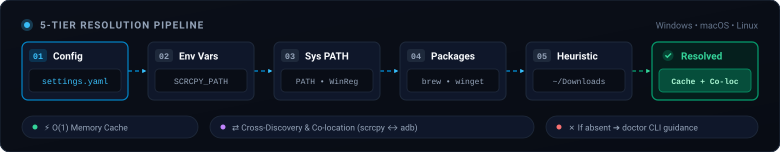
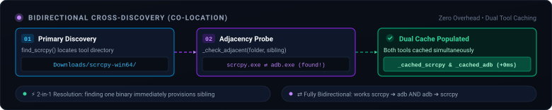

# 🛠️ Autonomous Tool Locator: `scrcpy` & `adb` (`ToolLocator`)

This document details the **architectural and technical specifications** of the autonomous detection subsystem for **scrcpy** and **ADB** integrated into the bot core ([`core/system_tools.py`](core/system_tools.py)).

> 📖 **User Guide Note**:  
> For bot setup, CLI parameters, console commands, and Discord bot usage:  
> 👉 [**COMMANDS.md**](COMMANDS.md) *(Available in [English](COMMANDS.md) and [Italian](COMMANDS.it.md))*

---

## 🎯 1. Architectural Goals

The `ToolLocator` module provides complete, zero-friction bot portability across any operating system without requiring manual PATH adjustments, dedicated launcher scripts (`.bat` / `.sh`), or hardcoded machine-specific absolute directories.

Key architectural requirements:
1. **Zero-Configuration**: Transparent detection of `scrcpy` and `adb` if already installed on the host system (via package managers, manual folder extractions, or existing PATH entries).
2. **Native Cross-Platform**: Full agnostic support for **Windows 10/11**, **macOS (Apple Silicon M1/M2/M3/M4 & Intel)**, and **Linux**.
3. **Standalone Binary Resilience**: Identical behavior whether executed as source code (`python main.py`) or packaged as a standalone binary ([`build_dist.py`](build_dist.py) -> `dist/dokkan-bot/`).
4. **Intelligent Co-Location**: Opportunistic cross-discovery between tools (official `scrcpy` releases include a bundled copy of `adb`).

---

## 🏛️ 2. Hierarchical 5-Tier Discovery Sequence

When the bot requests a tool binary (`find_scrcpy()` or `find_adb()`), `_resolve(tool_name, configured_path)` systematically evaluates a strict 5-tier resolution ladder:

### 📊 Animated Architecture Diagram (5-Tier Discovery)


---

### 🔹 Tier 1: Explicit Configuration (`config/settings.yaml`)
- **Purpose**: Allows advanced users to force a custom path via configuration.
- **Resolution logic**:
  1. Checks if configured value (`tools.scrcpy_path` or `tools.adb_path`) differs from generic fallback names (`"scrcpy"` or `"adb"`).
  2. If an existing file is provided, converts it to a normalized absolute path.
  3. If a directory is provided, appends the OS-specific executable name (`scrcpy.exe` on Windows, `scrcpy` on Unix/macOS) and validates existence.
  4. If invalid or empty, silently falls back to Tier 2.

---

### 🔹 Tier 2: Dedicated Environment Variables
- **Purpose**: Supports CI/CD pipelines, containerized environments, and developer Android SDK configurations.
- **Variables evaluated for `scrcpy`**:
  - `SCRCPY_PATH`
  - `SCRCPY_DIR`
  - `SCRCPY_HOME`
  - `SCRCPY_BIN`
- **Variables evaluated for `adb`**:
  - `ADB_PATH`
  - `ANDROID_HOME`
  - `ANDROID_SDK_ROOT`
- **Logic**: For `ANDROID_HOME` and `ANDROID_SDK_ROOT`, automatically scans the standard `platform-tools/adb` (or `platform-tools/adb.exe`) subdirectory.

---

### 🔹 Tier 3: System PATH & Live Windows Registry Bypass

1. **Standard Lookup (`shutil.which`)**:
   - Queries directories in the current process `PATH` environment variable.
2. **Tier 3b - Live Windows Registry Scan (`winreg`)**:
   - **Real-world issue**: When a user installs `scrcpy` or `adb` (via installer or manual system variable edit), existing open terminal windows do not inherit the updated PATH unless restarted.
   - **Solution**: `_scan_windows_registry_path()` directly queries Windows Registry hives:
     - User Key: `HKCU\Environment` -> `Path`
     - System Key: `HKLM\SYSTEM\CurrentControlSet\Control\Session Manager\Environment` -> `Path`
   - Dynamically parses registered directories to detect newly installed binaries immediately, without requiring a shell or terminal restart.

---

### 🔹 Tier 4: Canonical OS Paths & Package Managers

If the binary is not in PATH, the resolver probes standard package manager installation targets by operating system:

#### 🍏 macOS (Darwin)
- **Homebrew (Apple Silicon)**: `/opt/homebrew/bin/scrcpy`, `/opt/homebrew/bin/adb`
- **Homebrew (Intel x86_64)**: `/usr/local/bin/scrcpy`, `/usr/local/bin/adb`
- **Android Studio macOS SDK**: `~/Library/Android/sdk/platform-tools/adb`
- **MacPorts**: `/opt/local/bin/scrcpy`
- **macOS App Bundles**: `/Applications/scrcpy.app/Contents/MacOS/scrcpy` and `~/Applications/scrcpy.app/...`

#### 🪟 Windows (`win32`)
- **WinGet**:
  - `%LOCALAPPDATA%\Microsoft\WinGet\Links\scrcpy.exe`
  - `%LOCALAPPDATA%\Microsoft\WinGet\Packages\...`
- **Scoop**:
  - `%USERPROFILE%\scoop\shims\scrcpy.exe` (and `adb.exe`)
  - `%USERPROFILE%\scoop\apps\scrcpy\current\scrcpy.exe`
  - `%PROGRAMDATA%\scoop\shims\...`
- **Chocolatey**:
  - `%PROGRAMDATA%\chocolatey\bin\scrcpy.exe`
  - `C:\tools\scrcpy\scrcpy.exe`
- **Android Studio Windows SDK**:
  - `%LOCALAPPDATA%\Android\Sdk\platform-tools\adb.exe`
- **Typical Standalone Locations**:
  - `C:\platform-tools\adb.exe`
  - `C:\scrcpy\scrcpy.exe`
  - `C:\Program Files\scrcpy\scrcpy.exe`
  - `C:\Program Files (x86)\scrcpy\scrcpy.exe`

#### 🐧 Linux
- Standard FHS and Snap targets: `/usr/bin`, `/usr/local/bin`, `/snap/bin`, `~/.local/bin`.

---

### 🔹 Tier 5: Dynamic Personal Folder Heuristics (Globbing)

Users frequently extract official `scrcpy` releases (ZIP format) into `Downloads` or `Desktop` without configuring system PATH.

- **Root directories inspected**:
  - `~/Downloads`
  - `~/Desktop`
  - `~/Documents`
  - `%LOCALAPPDATA%\Programs` (Windows)
  - `%LOCALAPPDATA%\Microsoft\WinGet\Packages` (Windows)
  - `C:\Program Files` and `C:\`
- **Recursive search patterns**:
  - `scrcpy*/scrcpy.exe`
  - `scrcpy*/**/scrcpy.exe`
  - `platform-tools*/adb.exe`
- **Heuristic Temporal Selection**:
  If multiple extracted folders exist (e.g. `scrcpy-win64-v2.7` and `scrcpy-win64-v3.1`), the engine collects all matches (excluding `.lnk` shortcuts) and sorts by last modification date (`os.path.getmtime`) in descending order:
  ```python
  matches.sort(key=lambda p: os.path.getmtime(p) if os.path.exists(p) else 0, reverse=True)
  return os.path.abspath(matches[0])  # Most recent build takes priority
  ```

---

## 🔄 3. Bidirectional Co-Location Algorithm (Cross-Discovery)

Official Windows packages of `scrcpy` bundle both `scrcpy.exe` and `adb.exe`.

To maximize performance and prevent redundant filesystem scans:
1. When `ToolLocator.find_scrcpy()` locates a binary, it invokes `_check_adjacent(scrcpy_path, "adb")`.
2. If `adb.exe` exists in the same folder and is executable, it is cached immediately as default ADB binary (`_cached_adb`).
3. The identical process works in reverse: discovering `adb` automatically registers adjacent `scrcpy.exe`.

### 📊 Co-Location Diagram (Cross-Discovery)


---

## ⚡ 4. In-Memory Caching & Runtime Invalidation

Successful discoveries are preserved in class-level cache:
- `ToolLocator._cached_scrcpy`
- `ToolLocator._cached_adb`

Before returning a cached path, `os.path.isfile()` ensures the physical binary still exists on disk. If the user deleted or moved the folder during runtime, the cache is invalidated and discovery triggers afresh.

---

## 🩺 5. Diagnostic Engine & Runtime Inspection (`doctor`)

A built-in diagnostic tool can be run from the terminal (`dokkan-bot --doctor` or the interactive `doctor` command):

```bash
python main.py --doctor
```

### Diagnostic Features:
1. **Safe Version Detection**:
   - Executes identified binaries with `--version` or `version`.
   - Uses `subprocess.run` with `capture_output=True` and a **strict 4-second timeout** to prevent hanging if ADB freezes while spawning daemon instances.
2. **OS-Specific Installation Guidance**:
   - If either tool is missing, the diagnostic output provides exact copy-paste installation commands:
     - **macOS**: `brew install scrcpy android-platform-tools`
     - **Windows**: `winget install Genymobile.scrcpy`
     - **Linux**: `sudo apt install scrcpy adb`

---

## 📦 6. Standalone Binary Compatibility (PyInstaller)

In the standalone executable produced by [`build_dist.py`](build_dist.py), the Python runtime is frozen:

1. **Internal Resource Resolution (`get_resource_path`)**:
   - When `sys.frozen` is active, static assets (CV templates in `templates/glb/` and translation files in `locales/`) are resolved from `sys._MEIPASS`.
2. **User Configuration Resolution (`get_config_path`)**:
   - To let users customize settings (Discord token, language, custom paths) without rebuilding, `config/settings.yaml` is searched in order:
     1. Current working directory (`cwd`).
     2. Directory containing the executable (`exe_dir/config/settings.yaml`).
     3. Fallback bundled default inside the executable.

---

## 📊 7. Platform Support Matrix

| Feature | Windows | macOS (Apple Silicon) | macOS (Intel) | Linux |
|---|:---:|:---:|:---:|:---:|
| Standard PATH Resolution | ✅ | ✅ | ✅ | ✅ |
| Live Registry Bypass (WinReg) | ✅ | N/A | N/A | N/A |
| Homebrew (`/opt/homebrew`) | N/A | ✅ | N/A | N/A |
| Homebrew (`/usr/local`) | N/A | N/A | ✅ | ✅ |
| Android SDK Platform-Tools | ✅ | ✅ | ✅ | ✅ |
| Package Managers (WinGet, Scoop, Choco) | ✅ | N/A | N/A | N/A |
| User Folder Globbing (Downloads/Desktop) | ✅ | ✅ | ✅ | ✅ |
| Scrcpy / ADB Co-Location | ✅ | ✅ | ✅ | ✅ |
| Integrated `doctor` Diagnostics | ✅ | ✅ | ✅ | ✅ |
