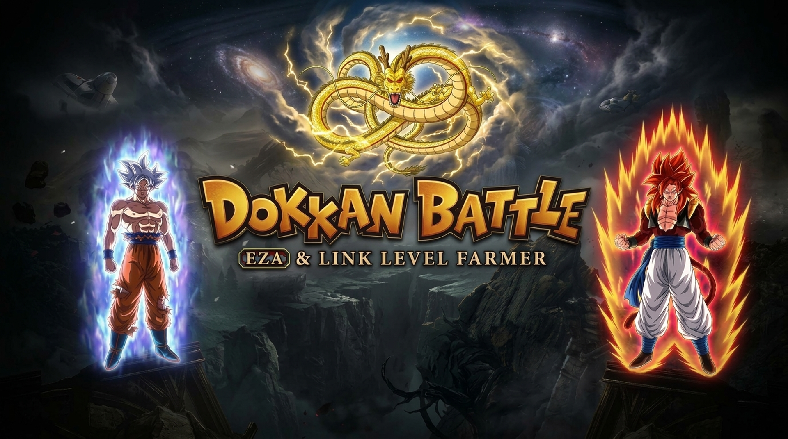

<p align="center">
  
</p>

<h1 align="center">Dokkan-EZALink-Farmer — DBZ Dokkan Battle Automation</h1>

<p align="center">
  <strong>An autonomous, high-performance companion bringing computer vision automation for Extreme Z-Battle (Lv. 999 Zeni) and Chamber of Spirit and Time Link Leveling to Dragon Ball Z: Dokkan Battle.</strong>
</p>

<p align="center">
  <a href="https://github.com/SolaneHub/Dokkan-EZALink-Farmer/releases"></a>
  <a href="https://www.python.org/"></a>
  <a href="https://www.microsoft.com/windows"></a>
  <a href="https://github.com/astral-sh/ruff"></a>
  <a href="https://github.com/microsoft/pyright"></a>
  <a href="LICENSE"></a>
</p>

<p align="center">
  <a href="https://github.com/SolaneHub/Dokkan-EZALink-Farmer/releases/latest/download/Launch-Dokkan-EZALink.exe">
    
  </a>
  <br>
  <a href="https://github.com/SolaneHub/Dokkan-EZALink-Farmer/releases">
    
  </a>
</p>

<p align="center">
  <a href="#features">Key Features</a> •
  <a href="#automation-matrix">Automation Matrix</a> •
  <a href="#quick-start">Quick Start</a> •
  <a href="#cli-controls">CLI Controls</a> •
  <a href="#architecture">Architecture</a> •
  <a href="#security">Security</a> •
  <a href="#issues">Issues & Feedback</a> •
  <a href="#license">License</a>
</p>

<p align="center">
  📖 <b>Documentation Guides:</b> 
  <a href="docs/COMMANDS.md">🇬🇧 Full Commands Guide</a> • 
  <a href="docs/COMMANDS.it.md">🇮🇹 Guida Comandi (Italiano)</a> • 
  <a href="docs/DISCORD_SETUP.md">💬 Discord Setup Guide</a>
</p>

---

<h2 id="features">✨ Key Features</h2>

- **Laser-Focused Endgame Automation**:
  - **1. Infinite Zeni via Extreme Z-Battle (EZA Lv. 999)**: Automatically climbs Z-Battles up to Level 999, farming infinite Platinum Hercule Statues (~1.5M Zeni per stage clear) with 0 Stamina cost.
  - **2. Advanced Multi-Stage Link Leveling & Deck Rotation**:
    - **Interactive Stage Selection**: Choose between top farming locations via an interactive terminal dropdown or Discord command:
      - **Area 39 Stage 3**: Great stamina-friendly option (also drops green gems) | 5 fights.
      - **Area 35 Stage 1**: Good stamina-friendly option (also drops blue gems) | 4 fights.
      - **Chamber of Spirit and Time** (*Stanza dello Spirito e del Tempo*): Daily link level event.
    - **Cumulative Card Rarity Filters (`--ur` & `--lr`)**: Filter and unmax UR and LR cards independently or together (e.g. `link --ur --lr`).
    - **"Attempt Again" Rapid Restart Looping**: Automatically detects the red "Attempt Again" button and confirms stamina deduction to restart stages instantly without navigating back through menus.
    - **Single-Setup Filter Optimization**: Box sorting (*Released*, *Level Up Possible*, rarity filters) is verified and configured **only on Run 1**; subsequent runs immediately clear and insert cards from the pre-filtered box for ultra-fast cycles.
- **Dual-Engine Operation (Local CLI & Discord Bot)**:
  - Operate entirely via local terminal commands or deploy the Discord bot daemon to start, pause, inspect, and receive completion alerts remotely on mobile.
- **Autonomous ToolLocator Discovery**:
  - Probes and detects `adb` and `scrcpy` across Windows (WinGet, Scoop, Chocolatey, Program Files, Downloads), macOS (Homebrew Apple Silicon & Intel, Android SDK), and Linux with zero PATH configuration required.
- **Multi-Instance Collision Protection**:
  - Uses native Windows kernel mutexes (`Global\Dokkan-EZALink-Farmer-SingleInstance`) and POSIX file locks to guarantee single-instance execution per device socket.
- **Subprocess Environment Isolation**:
  - Automatically purges PyInstaller runtime variables (`_MEIPASS`, `PYTHONPATH`) when spawning child processes, avoiding DLL conflicts with `scrcpy` and ADB.
- **Modern Deterministic Python Packaging**:
  - Managed strictly via [uv](https://docs.astral.sh/uv/) and Hatchling with Python 3.10+ requirement, passing `ruff` and `pyright` in standard mode with 0 errors and 0 warnings.

---

<h2 id="automation-matrix">🎮 What Appears on Screen & Automation Matrix</h2>

The bot detects and operates in both **English** and **Italian** game clients seamlessly:

| Mode | Target Stage / Event | In-Game Action | Stamina Cost | Deck & Farming Behavior |
| :--- | :--- | :--- | :---: | :--- |
| **EZA 999 (Zeni Farm)** | Selected Z-Battle or lowest uncompleted (< 999) | Auto-climbs consecutive battles up to Lv. 999 | **0 STA** | Preserves current team & picks friend leaders |
| **Link Leveling (Quest 39-3)** | Quest Story Area 39 Stage 3 | 5 Auto-Battles, drops Green Incredible Gems | 25-40 STA | Cumulative `--ur`/`--lr` filters, swaps maxed units, loops via Attempt Again |
| **Link Leveling (Quest 35-1)** | Quest Story Area 35 Stage 1 | 4 Auto-Battles, drops Blue Incredible Gems | 25-40 STA | Cumulative `--ur`/`--lr` filters, swaps maxed units, loops via Attempt Again |
| **Link Leveling (Chamber)** | *Chamber of Spirit and Time* (Event) | Clears *1. Saiyan Training* (SUPER) | 40 STA | Enforces *Released* + *Level Up Possible* & auto-refills |
| **Boost Support** | Link Level Stages | Toggles Boost on/off (`--boost` / `--no-boost`) | Normal | Maximizes link skill level-up chance |
| **Emergency Stops** | Any Mode | Stops safely on Game Over, full box, or limit | - | Alerts user via CLI & Discord |

> [!TIP]
> **Zero Latency Phone Mirroring**: Connect your physical Android phone with USB Debugging enabled and run `.\dist\Launch-Dokkan-EZALink.exe --scrcpy` (or `uv run Launch-Dokkan-EZALink --scrcpy`) to project your phone's screen directly onto your desktop monitor with zero latency.

---

<h2 id="quick-start">🚀 Quick Start</h2>

1. **Download**: Grab the pre-compiled executable [Launch-Dokkan-EZALink.exe](https://github.com/SolaneHub/Dokkan-EZALink-Farmer/releases/latest/download/Launch-Dokkan-EZALink.exe) from Releases.
2. **Launch**: Run `Launch-Dokkan-EZALink.exe` (or use `main.py` in developer mode).
3. **Connect Device**: Start your emulator (BlueStacks, LDPlayer, MuMu 12) or plug in your phone via USB with USB Debugging enabled. The bot detects it automatically!

---

<h2 id="cli-controls">🎛️ Command-Line & Diagnostics Controls</h2>

| Option / Flag | Description | Default |
| :--- | :--- | :---: |
| `--doctor` | Runs complete diagnostics check on ADB, scrcpy, OS, and connected devices | - |
| `--devices` | Lists all detected ADB serials, device models, and connection states | - |
| `--eza [LVL]` | Starts continuous EZA climbing up to target level | `999` |
| `--link [N]` | Starts Link Level farming for N runs (or until stamina depleted if omitted) | Unlimited |
| `--ur` | Filters box for UR rarity units during Link Level farming | Active (both) |
| `--lr` | Filters box for LR rarity units during Link Level farming | Active (both) |
| `--boost` / `--no-boost` | Enables or disables Boost Energy multiplier for Link Level runs | Config |
| `--scrcpy` | Launches zero-latency Android screen mirroring window on PC | - |
| `--discord` | Launches Discord Bot daemon for remote mobile control | - |
| `--check-updates` | Checks official GitHub Releases for newer verified updates | - |
| `--lang {en,it}` | Overrides interface language (`en` = English, `it` = Italian) | Auto |
| `--config <PATH>` | Custom path to YAML configuration file | `config/settings.yaml` |

---

<h2 id="architecture">🏛️ Technical Architecture</h2>

The codebase follows a clean, modular 4-tier architecture designed for high maintainability, separation of concerns, and full static type safety:

```text
src/dokkan_eza_link_farmer/
├── __init__.py               # Re-exports BotEngine, TerminalCLI, GameState, __version__
├── __main__.py               # CLI entrypoint (`python -m dokkan_eza_link_farmer`)
│
├── core/                     # Application lifecycle, settings & system startup
│   ├── bot_engine.py         # Central bot coordinator & task thread dispatcher
│   ├── i18n.py               # Bilingual translation engine (en/it catalogs)
│   ├── system_tools.py       # ToolLocator (ADB/scrcpy), paths, and SingleInstanceMutex
│   └── updater.py            # Cryptographic updater, SHA-256 verifier & process isolator
│
├── automation/               # Game state detection, computer vision & tasks
│   ├── game_state.py         # State machine enum & multi-scale UI detector
│   ├── vision.py             # OpenCV template matching, fuzzy matching & OCR helpers
│   └── tasks/                # Automation task implementations
│       ├── base_task.py      # Abstract thread-safe task base class
│       ├── eza_farm.py       # EZA 999 Zeni climbing task
│       └── link_level_farm.py# Chamber of Spirit & Time link leveling task
│
├── integrations/             # External services & protocols
│   ├── adb_client.py         # High-speed ADB socket wrapper & screencap decoder
│   ├── dokkandb_client.py    # DokkanDB REST API client & banner image cache
│   └── discord_bot.py        # Discord.py bot with slash commands & image streaming
│
├── ui/                       # Presentation layer
│   └── cli.py                # Rich interactive color terminal console & setup wizards
│
└── assets/                   # Static resources
    ├── config/settings.yaml  # Default configuration
    ├── locales/              # en.yaml & it.yaml translation dictionaries
    └── templates/glb/        # OpenCV reference templates for Global Dokkan UI
```

---

<h2 id="security">🔒 Security, Verification & Antivirus Transparency</h2>

All binaries published under [Releases](https://github.com/SolaneHub/Dokkan-EZALink-Farmer/releases) are built automatically in isolated, clean virtual machines via GitHub Actions (see [.github/workflows/release.yml](.github/workflows/release.yml)). The source code is 100% open-source, runs exclusively on your local machine, and does not collect, log, or transmit any user data or credentials.

### 🔍 Technical Breakdown of False Positives

If your antivirus or Windows SmartScreen displays an alert, here is exactly why it happens and why the binaries are safe:

#### 1. Why `Launch-Dokkan-EZALink.exe` shows heuristic detections:
- **Microsoft Defender (`Trojan:Win32/Wacatac.B!ml`)**:
  - The **`!ml`** suffix stands explicitly for **Machine Learning** — this is an automated cloud heuristic guess, not a known virus signature match.
  - `Launch-Dokkan-EZALink` is packaged using **PyInstaller**, which bundles Python 3.11 and dependencies into a self-extracting executable. Because some malware authors also package malicious scripts using packers, automated cloud ML heuristics frequently misclassify fresh, unsigned PyInstaller binaries under generic names like `Wacatac.B!ml`.
- **Static AI / Generic Scanners** (`SentinelOne: Static AI - Suspicious PE`, `Bkav Pro`):
  - These engines flag the binary due to legitimate Windows API calls: creating a named Windows mutex (used to enforce a single running instance on ADB sockets) and opening ADB loopback sockets.
- **Lack of Expensive EV Code-Signing Certificate**:
  - Commercial software publishers pay hundreds of dollars per year ($400+/year) for Extended Validation (EV) certificates to bypass SmartScreen and heuristics. As a free, open-source community tool, `Dokkan-EZALink-Farmer` is unsigned, so automated heuristics assign it a default "low reputation" score until enough community reputation builds.

---

### 🛡️ How to Verify and Run Safely

#### Cryptographic SHA-256 Checksum Verification
Every release publishes a `SHA256SUMS.txt` file created during the GitHub Actions build. You can verify your downloaded binary locally in PowerShell:
```powershell
Get-FileHash .\Launch-Dokkan-EZALink.exe -Algorithm SHA256
```
Compare the output with the checksums published in `SHA256SUMS.txt` on the release page.

#### Windows SmartScreen Prompt
On first launch, Windows SmartScreen may display *"Windows protected your PC"*:
1. Click **More info**.
2. Click **Run anyway**.

#### 100% Open Source — Build from Source
If you prefer not to use pre-compiled binaries, you can inspect the full source code and build it locally with complete autonomy:
```bash
git clone https://github.com/SolaneHub/Dokkan-EZALink-Farmer.git
cd Dokkan-EZALink-Farmer
uv sync
uv run python build_exe.py
```
Or run the Python application directly without compilation:
```bash
uv run python -m dokkan_eza_link_farmer
```

---

<h2 id="development">🛠️ Development & Building</h2>

<details>
<summary><b>Click to expand development instructions</b></summary>

<br>

### 1. Requirements
- Python 3.10+
- [uv](https://docs.astral.sh/uv/) (recommended package and project manager)

### 2. Setup Virtual Environment
```bash
uv sync
```

### 3. Code Quality & Linting
```bash
# Lint checks
uv run ruff check

# Format check / auto-format
uv run ruff format

# Static type checking
uv run pyright

# Test suite execution
uv run pytest
```

### 4. Build Standalone Executable Locally
```bash
uv run python build_exe.py
```
The compiled binary will be placed in `dist/Launch-Dokkan-EZALink.exe`.

</details>

---

<h2 id="issues">💬 Issues, Feedback & Bug Reports</h2>

We welcome bug reports, feature suggestions, and questions from the community! If you run into any issues or have an idea to improve **Dokkan-EZALink-Farmer**, feel free to reach out:

| Type | Description | Link |
| :--- | :--- | :---: |
| 🐛 **Bug Report** | Found an issue, incorrect UI detection, or crash? | [**Submit Bug Report**](https://github.com/SolaneHub/Dokkan-EZALink-Farmer/issues/new?template=bug_report.yml) |
| ✨ **Feature Request** | Suggest new automation ideas, event mappings, or enhancements. | [**Request Feature**](https://github.com/SolaneHub/Dokkan-EZALink-Farmer/issues/new?template=feature_request.yml) |
| 💭 **Discussions** | General questions, troubleshooting, setup help, or feedback. | [**Join Discussions**](https://github.com/SolaneHub/Dokkan-EZALink-Farmer/discussions) |
| 🔒 **Security Report** | Discovered a vulnerability? Disclose it safely and privately. | [**Security Policy**](SECURITY.md) |

### 📋 Before Opening an Issue

1. **Check Existing Issues**: Search [open issues](https://github.com/SolaneHub/Dokkan-EZALink-Farmer/issues) and [closed issues](https://github.com/SolaneHub/Dokkan-EZALink-Farmer/issues?q=is%3Aissue+is%3Aclosed) to see if the topic has already been addressed.
2. **Update to Latest Version**: Verify that you are running the latest release from [Releases](https://github.com/SolaneHub/Dokkan-EZALink-Farmer/releases/latest).
3. **Provide Context**: When reporting a bug, please include:
   - Application version (e.g. `v1.0.4`)
   - Target device / emulator (BlueStacks 5, LDPlayer 9, physical phone)
   - Doctor diagnostics log (`Launch-Dokkan-EZALink.exe --doctor` or `python main.py --doctor`)
   - Operating system version
   - Clear steps to reproduce and any relevant screenshots

---

<h2 id="license">📜 License, Privacy & Terms</h2>

This project is licensed under the **[MIT License (with Attribution)](LICENSE)** — see the [LICENSE](LICENSE) file for details. Any redistribution, fork, or derivative work must retain prominent attribution to the original author (**SolaneHub**) and include a visible link back to the project repository: `https://github.com/SolaneHub/Dokkan-EZALink-Farmer`.

For transparency and privacy compliance, review our **[Privacy Policy](PRIVACY.md)** (100% zero-data, strictly local) and **[Terms of Service](TERMS.md)**.

*Dragon Ball Z: Dokkan Battle* is a trademark of BIRD STUDIO / SHUEISHA, TOEI ANIMATION, BANDAI NAMCO Entertainment Inc., and Akatsuki Inc. This application is an unofficial, community-made tool and is not affiliated with or endorsed by Bandai Namco Entertainment or Akatsuki.
